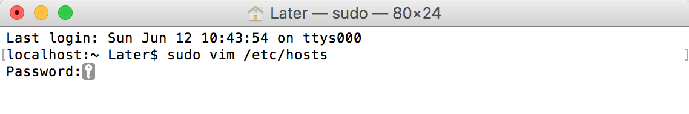
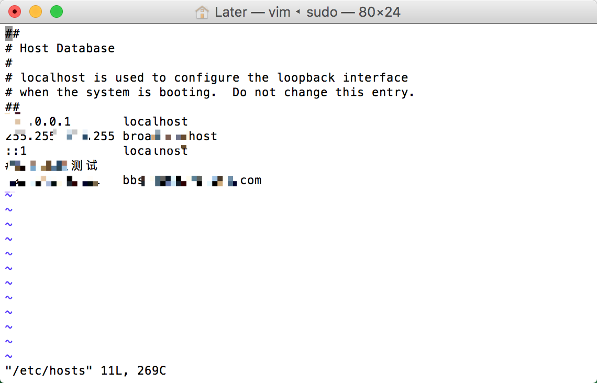

mac的hosts文件路径/etc/hosts，修改是需要用户权限的，mac不允许直接修改，可以使用终端命令行修改。

##  终端输入：sudo vim /etc/hosts或者sudo vi /etc/hosts

##输入用户密码，不显示任何内容，直接Enter确认

 

##命令行"o"开始编辑

##编辑结束，esc退出编辑，输入命令行":wq"保存退出。至此hosts修改结束。