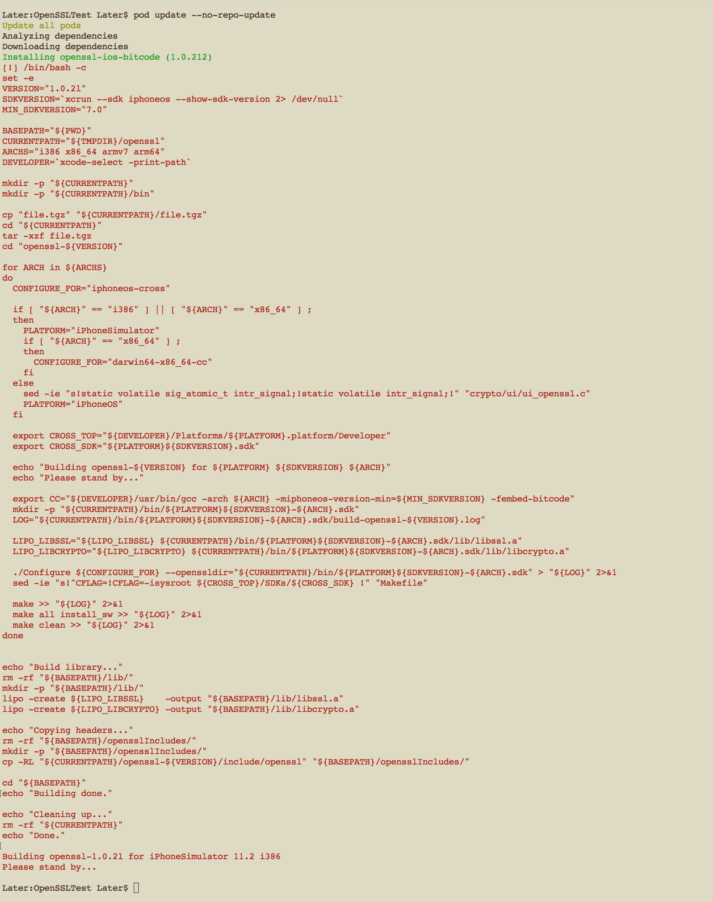
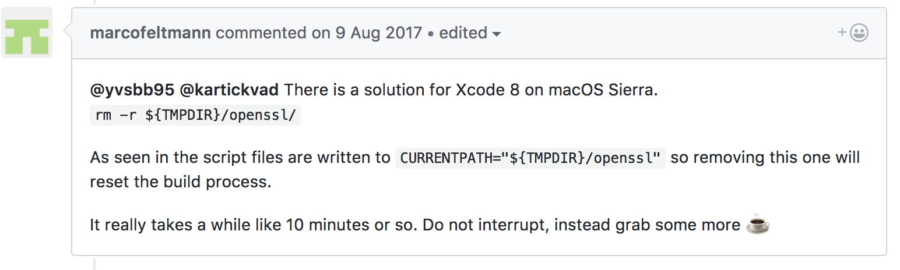

##问题描述

项目的 Podfile 文件中包含有 'pod 'openssl-ios-bitcode', '~> 1.0.212'' ， ’pod update —no-repo-update'，报错。



##解决方案

```shell
 rm -r ${TMPDIR}/openssl/
```



参考资料:[https://github.com/FredericJacobs/OpenSSL-Pod/issues/32](https://github.com/FredericJacobs/OpenSSL-Pod/issues/32)

##问题原因

思考中，有知道的给告诉下。